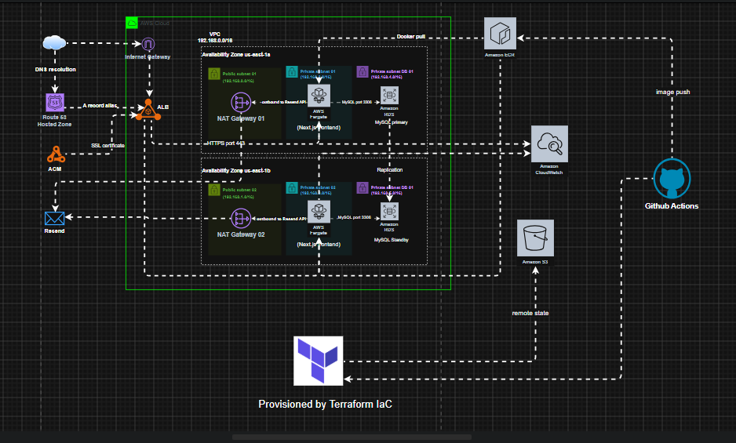

# Rampart Defence Engineering — Platform

A A containerised Next.js application deployed on AWS with full infrastructure automation for an armoured vehicle engineering company, built on AWS using Terraform and deployed via GitHub Actions CI/CD.

**Live site:** Deployable on demand - see [Infrastructure](#infrastructure) below.

---

## Repository structure

```
rampart-defence-platform/
├── frontend/           # Next.js 14 app (TypeScript, Tailwind CSS, Resend)
├── infrastructure/     # Terraform IaC (VPC, ECS, RDS, ALB, Route 53, ACM)
└── README.md
```

---

## Architecture



| Tier         | Technology                | Description                                               |
| ------------ | ------------------------- | --------------------------------------------------------- |
| Presentation | Next.js 14 on ECS Fargate | Server-side rendered React app with built-in API route    |
| Application  | Resend API                | Transactional email delivery for contact form submissions |
| Data         | RDS MySQL 8.0             | Managed relational database in private subnets            |

### Infrastructure overview

| Component               | Service                                          |
| ----------------------- | ------------------------------------------------ |
| DNS                     | Namecheap → Route 53 hosted zone                 |
| SSL                     | AWS ACM (auto-renewing, native ALB integration)  |
| Load balancing          | Application Load Balancer (HTTPS port 443)       |
| Container orchestration | ECS Fargate (serverless, two availability zones) |
| Container registry      | Amazon ECR                                       |
| Networking              | VPC, public/private subnets, NAT gateways        |
| State management        | S3 remote backend                                |
| IaC                     | Terraform (modular)                              |
| CI/CD                   | GitHub Actions + self-hosted Docker runner       |
| Security scanning       | tfsec                                            |
| Email delivery          | Resend                                           |

---

## Frontend

Built with Next.js 14 App Router, TypeScript, and Tailwind CSS.

**Key features:**

- Server-side contact form handling via Next.js API route (`app/api/enquiry/route.ts`)
- Zod schema validation on form inputs
- Transactional email via Resend - no separate backend service required
- Containerised with Docker, served on port 3000

```bash
cd frontend
npm install
npm run dev
```

Set environment variable:

```env
RESEND_API_KEY=re_key_here
```

---

## Infrastructure

All AWS resources provisioned with Terraform across four modules:

| Module            | Resources                                                                         |
| ----------------- | --------------------------------------------------------------------------------- |
| `module-vpc`      | VPC, public/private subnets, NAT gateways, route tables, security groups          |
| `module-ecs`      | ECS cluster, Fargate services, ALB, target groups, ECR repositories, IAM roles    |
| `module-dns`      | Route 53 hosted zone, ACM certificate, DNS validation records, Resend DNS records |
| `module-database` | RDS MySQL instance, subnet groups                                                 |

### Deploy

```bash
cd infrastructure

# Configure backend
# Update backend.tf with S3 bucket name

# Set variables
cp terraform.tfvars.example terraform.tfvars
# Fill in your values

# Deploy
terraform init
terraform plan
terraform apply -auto-approve

# Get nameservers for your domain registrar
terraform output route53_name_servers

# Tear down
terraform destroy -auto-approve
```

### GitHub secrets required

```
AWS_ACCESS_KEY_ID
AWS_SECRET_ACCESS_KEY
AWS_REGION
TF_VARS_SECRET        # full contents of terraform.tfvars
```

---

## CI/CD pipeline

Every push to `main` triggers the GitHub Actions workflow:

```
Checkout → Configure AWS credentials → Terraform init
→ Write terraform.tfvars from secret → terraform fmt
→ terraform validate → tfsec security scan
→ terraform plan → terraform apply
```

The pipeline runs on a self-hosted runner containerised in Docker, deployed on an EC2 instance within the same AWS account.

---

## Key design decisions

**ECS Fargate over EKS** - removes node management entirely. No EC2 worker nodes to patch or size. AWS manages the underlying compute; the ALB handles routing. A cleaner fit for a two-service deployment than running a full Kubernetes control plane at additional cost.

**ACM over Let's Encrypt** - ACM certificates are free, auto-renewing, and natively integrated with the ALB. No cert-manager, no renewal cron jobs, no nginx configuration.

**Next.js API route over separate backend** - the contact form is the only server-side operation. A dedicated Express service would add deployment complexity, a second ECR repository, a second ECS service, and ALB routing rules for a single endpoint. The Next.js API route handles it in the same container with zero additional infrastructure.

**Modular Terraform** - each concern lives in its own module with explicit inputs and outputs. Modules are independently testable and reusable across environments.

---

## Author

Kazeem Jimoh · [LinkedIn](https://www.linkedin.com/in/kazeem-jimoh-027a3b21a/) · [GitHub](https://github.com/qezman)
